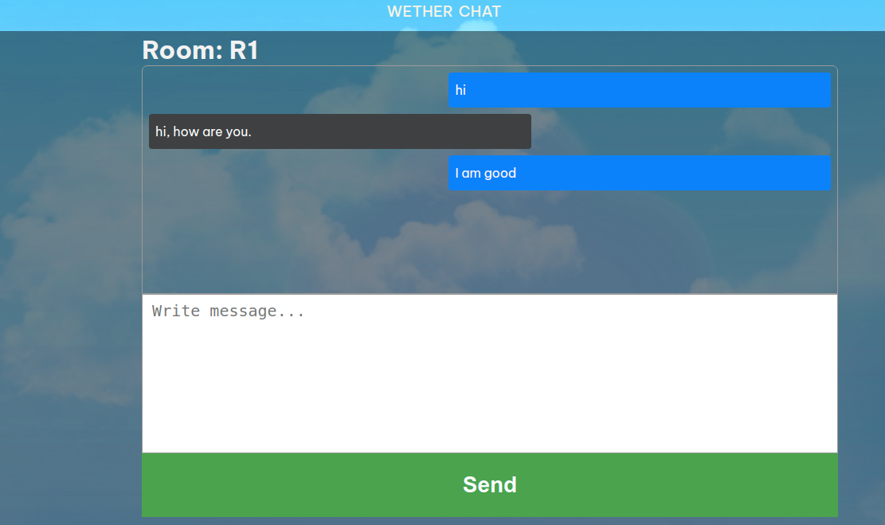

# README

## Setup

### Clone and enter repository

##### enter repository client
Install dependencies.
npm start
Open http://localhost:3000 to view it in the browser.

##### enter repository server
Install dependencies.
npm start
Server Listening on port 4000

#### For weather
Enter the city name in search box to know the weather of any city.

#### For Chat
open http://localhost:3000 in two different tab.
Click on the chat link at top.
Enter the same Room code in both the tab and click on Join Room.
Now type message and click send and see on the other tab.

